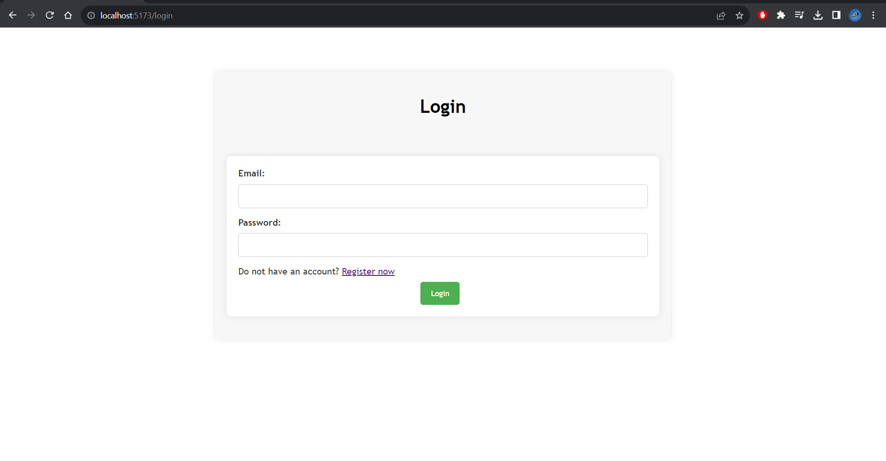
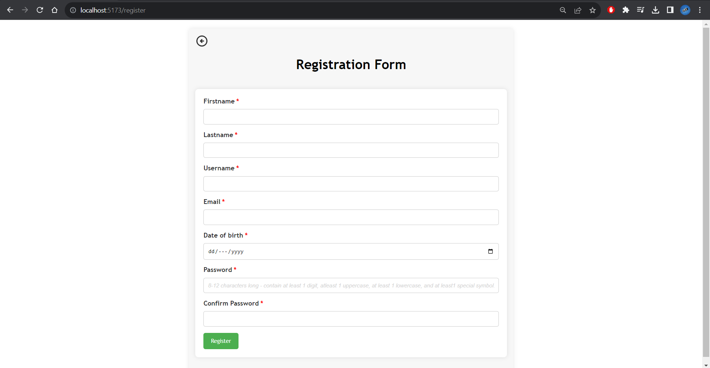
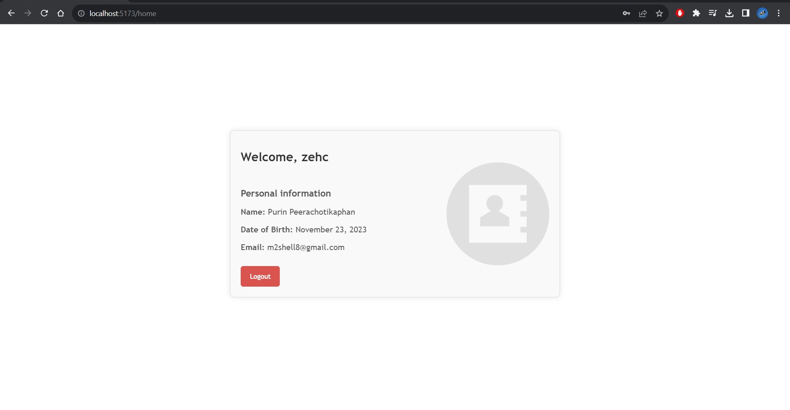

# Regis/Login

## - Login Page (/login)

    
  
กรอก email และ password เพื่อทำการ Login เข้าสู่หน้า user ถ้าหากยังไม่มีบัญชี จะต้องลงทะเบียนก่อนที่ Register now

## - Register Page (/register)

    
    
กรอกข้อมูลให้ครบตามที่ require เพื่อทำการสร้าง user และ password ใหม่ สำหรับใช้ Login เข้าสู่หน้า user page

## - User Page (/home)

    
    
user page จะแสดงข้อมูล Personal Information ของ user ที่ทำการ Login เข้ามา (ถ้าหากยังไม่มี Account จะไม่สามารถเข้าถึงหน้า user page ได้)

